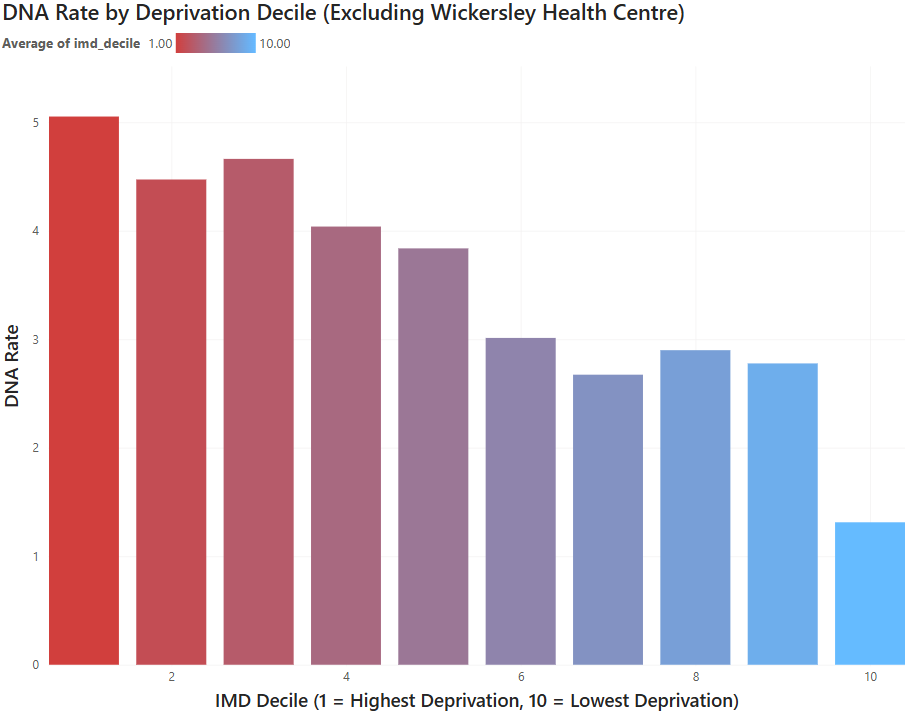

A deeper look at my South Yorkshire GP analysis — why appointment access stayed flat across deprivation levels, but DNA rates didn't, and what that might actually mean.
<!--more-->

## Why this project?

GP access and health inequality come up constantly in public discussion, but as for everything in politics, it's rare you see real numbers, and it's even rarer you see something local. I wanted to build something that:
- Used current, publicly available government data.
- Was local to me (South Yorkshire).
- Gave a result that was meaningful and based on solid mathematics.
- Combined SQL, Python, and Power BI in one project, similar to a real working environment.

The question I chose to explore was how does deprivation affect how many appointments GP practices deliver, and how likely patients are to attend them?

## Data Sources & SQL Cleaning
The data sources I used are talked about in the project post itself (along with download links for anyone curious), but it was a combination of two NHS datasets, and then one dataset from ONS and gov.uk respectively. This covered all the bases I needed of deprivation scores, locations, and GP data.

The first problem I spotted came while I was cleaning and combining the data using SQL. Carrfield Medical Centre (C88082) appeared twice in the practice reference data, identical in every column except SUPPLIER, where one row said EMIS, the other EMIS/ARCHVALE. Almost certainly a mid-period clinical system migration recorded as two separate states (the reason isn't relevant however, more that I noticed it).

The second problem was that of a missing month. March 2026 appointment data simply wasn't published by NHS England (unless I am missing something), so I had to run samples from November to May but exclude March. Once again though, for my work this didn't really matter, as I'm not looking at time related trends.
The final data combing issue was with the postcodes. My 169 practices only resolve to 154 unique postcodes, which meant several practices operate out of shared health centre buildings (or just happen to be in the same postcode). This meant the postcode-to-deprivation join has some duplicate deprivation values, but this is fine and is not an issue.

## Making the Database

I loaded everything into a single SQLite database with four tables for appointments, practices, patient lists, and practice deprivation. SQLite meant the whole database would be a single portable file, and it had full SQL support for everything I needed.

I then used the practice postcodes to find their deprivation, by assigning postcodes to their LSOAs and finding the IMD (Index of Multiple Deprivation) decile of each LSOA. Since the database from the ONS was too large to comfortably load in memory, I read it in chunks, filtering to just my 169 target postcodes as I went, rather than loading the whole UK-wide file at once.

This then led to me having an analysis table containing everything I needed. The GP name, its IMD decile and its GP statistics (DNA (Did Not Attend) rates, total number of patients, appointments per patient etc.)

## Spearman's

I used Spearman's rank correlation for a reason. IMD decile is an ordinal ranking (1st most deprived, 2nd, and so on), not a continuous measurement where the gap between values is guaranteed to mean the same thing throughout the scale. Spearman works on ranks rather than raw values, so it felt like the correct method for my project.

## Results

The numbers behind the results can be seen on my project page. There is a link just below to view the graphs if you'd like on this page though. The main takeaway is that there is no connection between deprivation and appointment availability, but there *IS* a connection between deprivation and DNA rates, with a higher rate of people missing or not attending appointments in more deprived areas. Why do I think this is? Well, without running further data analysis (which maybe could be a good future project), my belief is this is due to the greater hardships of everyday life when living in deprivation. Less work security (finding it harder to take time off, or being scared time off may lead to you being dismissed), finding it harder to access public (and personal) transport, or the higher rates of chronic illness in more deprived areas, which can make accessing healthcare systems overwhelming or difficult for some. I believe there would be some good work to be done here exploring these connections, but I'll leave that for another time.

Main results

Results without outlier

 

## Tools Used

SQL (SQLite) — data storage, joins, conditional aggregation, building the core analysis table

Python (pandas, scipy) — data cleaning, postcode normalisation, chunked file processing for the large ONSPD file, Spearman correlation testing

Power BI — interactive dashboard, conditional formatting, DAX-based outlier labelling, scatter/bar visualisation with trend lines
