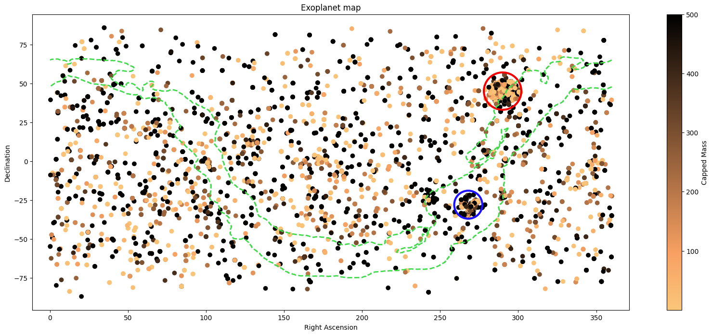

Analysis of a dataset of confirmed exoplanets. Cleaned and visualised detection data across different telescopes and facilities, and performed an investigation into detection methods.
<!--more-->
This project explores a real-world dataset of confirmed exoplanets, working with quite messy astronomical data to uncover patterns in how and where planets are detected.

The core of the work involved building custom dataframes from scratch, aggregating planet detections by star system, ranking discovery facilities by output, and calculating custom metrics like each facility's observational range across the sky (right ascension and declination). I also built a full sky map plotting every detected exoplanet by position, coloured by mass, with the Milky Way's outline overlaid.

*Exoplanet detections across the sky, coloured by capped mass, with two dense detection clusters circled in red and blue*

These two dense clusters correspond to specific survey strategies. The red cluster
matches Kepler's field of view. My facility analysis showed Kepler observes a single,
fixed point in the sky rather than scanning broadly, consistent with its real-world
mission of staring continuously at one patch of sky between Cygnus and Lyra. The blue
cluster sits in the direction of the galactic bulge, where microlensing surveys like
OGLE concentrate their observations due to the high density of background stars there.

## Open-Ended Analysis

Beyond this initial setup, I decided to look at these 3 questions:

- Which facilities contributed the most detections, and what methods did they favour?
- Do certain facilities specialize in observing specific regions of the sky (northern/southern hemisphere vs whole-sky coverage)?
- What patterns emerge across different discovery methods? For example, why do "Imaging" detections have such different orbital period distributions compared to "Transit" detections?

Each answer was backed by pandas analysis and supporting visualizations.

## Downloads

<a href="/files/exoplanet.ipynb" download>📓 Download the Notebook (.ipynb)</a> 
