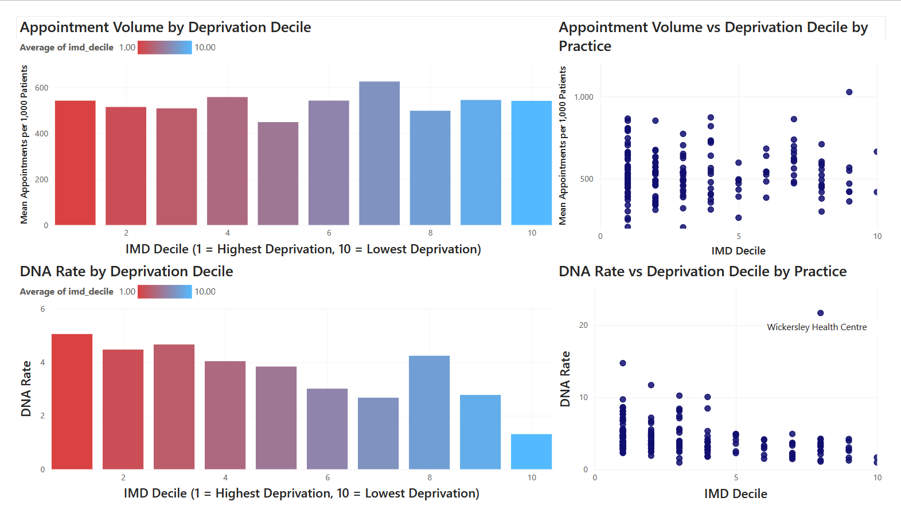

A large scale exploration of GP access and DNA (did not attend) rates across South Yorkshire, and the link these statistics have to rates of deprivation.

<!--more-->

## The Question

GP access is often discussed in terms of deprivation, but it's not commonly explored at a local, practice by practice level. I wanted to test it properly for South Yorkshire, seeing if practices in more deprived areas see a different pattern of attendance, or different level of access compared to those in less deprived areas.

## Data sources

This project combines four separate NHS/government datasets, joined together through a full SQL + Python pipeline:

- **Appointments in General Practice** (NHS England) Monthly, practice-level appointment records, including status, mode, and time between booking and appointment. Downloaded from [digital.nhs.uk](https://digital.nhs.uk/data-and-information/publications/statistical/appointments-in-general-practice).
- **Patients Registered at a GP Practice** (NHS England) Practice-level patient list sizes and postcodes, used to convert raw appointment counts into an appointments per 1,000 patients rate [digital.nhs.uk](digital.nhs.uk/data-and-information/publications/statistical/patients-registered-at-a-gp-practice).
- **English Indices of Deprivation 2025** (Ministry of Housing, Communities & Local Government) LSOA-level deprivation deciles, the current release as of October 2025. Downloaded from [gov.uk](gov.uk/government/statistics/english-indices-of-deprivation-2025)
- **ONS Postcode Directory (ONSPD), November 2025** (Office for National Statistics) Used to join GP practice postcodes to their LSOA, and from there to their deprivation decile. Downloaded from [ONS Open Geography Portal](geoportal.statistics.gov.uk/datasets/3635ca7f69df4733af27caf86473ffa1.)

Data covers **169 GP practices across NHS South Yorkshire ICB** (Barnsley, Doncaster, Rotherham, Sheffield sub-ICBs), for **six months between November 2025 and May 2026** (March 2026 data was not published by NHS England and is excluded).

## Methodology

1. Filtered national appointment and patient-list publications down to South Yorkshire practices using sub-ICB location codes
2. Built a SQLite database with practice-level appointment, patient list, and reference tables
3. Joined practice postcodes to LSOA-level deprivation deciles via the ONS postcode directory
4. Calculated appointments per 1,000 patients and DNA rate per practice, averaged across the six-month period
5. Tested both metrics against deprivation decile using Spearman's rank correlation (chosen over Pearson's since IMD (Index of Multiple Deprivation) decile is an ordinal ranking, not a continuous scale)
6. Built an interactive Power BI dashboard to visualise the results

## Findings

| Metric | Spearman's rho | p-value | Significant? |
|---|---|---|---|
| Appointments per 1,000 patients | -0.02 | 0.823 | No |
| DNA rate | -0.43 | < 0.001 | Yes |

**Appointment volume showed no meaningful relationship with deprivation** — practices in more and less deprived areas offer/deliver a broadly similar number of appointments per patient.

**DNA (missed appointment) rate showed a moderate, statistically significant relationship** — practices in more deprived areas see notably higher rates of missed appointments. This suggests deprivation in South Yorkshire may affect patients' ability to *attend* booked appointments more than it affects the *volume* of care on offer. The reasons for this are talked about more in my blog post, but suggests bigger issues are things such as inflexibility at work and access to transport.

*Power BI collection of visualisations*

Power BI visualisation of DNA vs IMD Decile excluding the Wickersley outlier.

## Limitations

- Patient list size was treated as a static snapshot (April 2026) across the whole period. I made this decision as changes in registered patient rates are negligible month to month.
- IMD 2025 uses a substantially revised methodology from the 2019 edition and is not directly comparable to older deprivation studies
- 169 practices share only 154 unique postcodes, as some operate from shared health centre sites
- One practice appeared twice in NHS reference data due to a mid-period clinical system migration, although this was dealt with during my SQL data cleaning process.

## Downloads

<a href="/files/southyorkshirehealth.pdf" download>📊 Short Power BI Report (.pdf)</a> 
<a href="/files/correlation.py" download>🐍 Spearman Correlation Analysis (correlation.py)</a> 
<a href="/files/build_patient_list_size.py" download>🐍 Patient List Size Builder (build_patient_list_size.py)</a> 
<a href="/files/deprivationtable.py" download>🐍 Deprivation Table Builder (deprivationtable.py)</a> 
<a href="/files/analysis_base.csv" download>📁 Trimmed and Sorted Dataset (analysis_base.csv)</a>

*A full write-up discussing these findings in more depth is available on my [blog](/blog/gp-deprivation-writeup/).*
