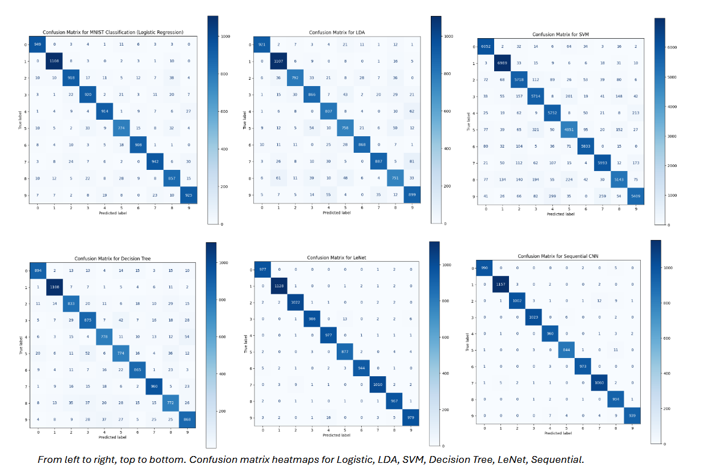
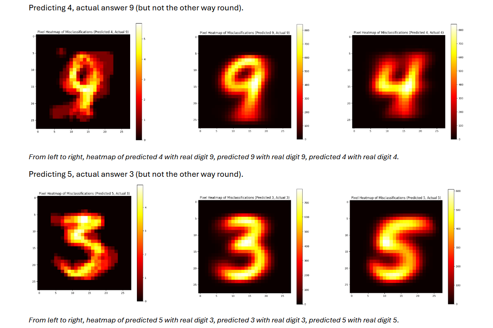

---

title: "Machine Learning: MNIST Digit Classification"

date: 2025-05-13

draft: false

slug: "mnist-digit-classification"

---

Comparison of 6 classification models, from Logistic Regression to CNNs, to predict handwritten digits from the MNIST dataset.

<!--more-->

This project tackles the classic MNIST handwritten digit dataset, comparing six models in two categories: traditional machine learning (Logistic Regression, LDA, SVM, Decision Tree) and CNNs (LeNet, a Sequential CNN built with Keras).

Each model was evaluated on precision, recall, F1 score and runtime to weigh accuracy against computational cost.

LeNet came out on top with a 0.99 F1 score, and notably being 3x faster than the Sequential CNN for near-identical accuracy. This makes sense given LeNet was purpose-built for digit recognition. The simpler models (Logistic Regression, LDA, Decision Tree) traded some accuracy for speed, with Logistic Regression the strongest of that group at 0.92 F1. SVM stood out as the weakest performer overall — high computational cost for comparatively unremarkable accuracy, likely due to MNIST's high dimensionality (784 features per image).

Looking directly at where LeNet fails, I looked at specific misclassified digit pairs.

The only two digit pairs LeNet confused more than 10 times were 4/9 and 5/3. Every model tested predicted 0s and 1s near-perfectly, likely due to their visually distinct shapes compared to other digits.

## Downloads

<a href="/files/numbermnist.ipynb" download>📓 Download the Notebook (.ipynb)</a> 
<a href="/files/numbermnist.pdf" download>📄 Download the Full Report (.pdf)</a>
