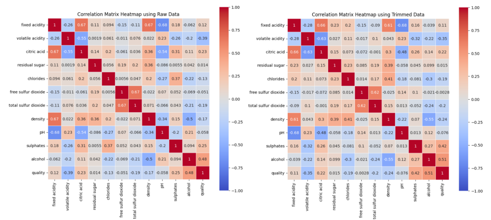
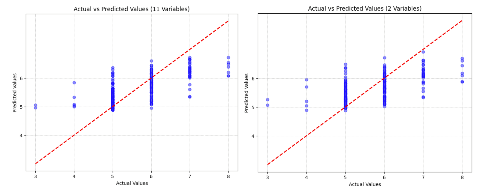

Built and compared 7 regression models to predict red wine quality from it's chemical
qualities, using methods from simple linear regression to Random Forest and XGBoost.
<!--more-->
This project explores a red wine quality dataset, aiming to predict quality scores from measurable properties like acidity, sulphates, and alcohol content. After cleaning the data (removing outliers using the 1.5×IQR rule, cutting ~25% of rows), I ran correlation analysis to identify the strongest predictors, with alcohol and sulphates standing out.

*Fig 1/2 — correlation heatmaps for raw (left) and trimmed (right) data*

From there, I built and compared seven regression approaches: linear regression (both full and reduced variable sets), ordinal regression, Random Forest, XGBoost, SVR, and polynomial regression (degree 2 and 3). Each model was evaluated using Mean Squared Error, Root Mean Squared Error, Mean Absolute Error, and R-squared.
Random Forest was the best model in this scenario, with the lowest MSE (0.360), narrowly ahead of XGBoost (0.369). Both polynomial models performed noticeably worse, while simpler models like linear regression and SVR still performed respectably, reinforcing that the tree-based ensemble methods held a modest edge here.

*Fig 3/4 — actual vs predicted values for each linear model*

## Downloads

- 📓 [Download the Notebook (.ipynb)](/files/project-1-notebook.ipynb)
- 📄 [Download the Full Report (.pdf)](/files/project-1-report.pdf)
